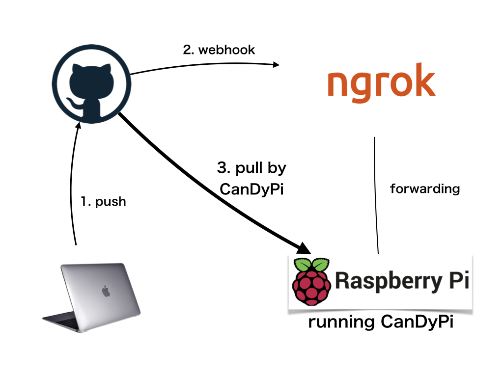

# CanDyPi - Continuous Delivery for raspberry Pi

CanDyPi allows you to continuous delivery for raspberry pi project.

## Requirements

- Python >= 3.6
- ngrok

## How to install

You can install CanDyPi by pip.

`$ pip install candypi`

## How to setup

### ngrok

`$ ngrok http [port]`

### GitHub

Add ngrok's https address to Webhooks settings.

## How to use

`$ candypi [git directory]`

### options

- `-b` `--branch` - the branch of Automatic updating. Default is 'master' branch.
- `-p` `--port`
